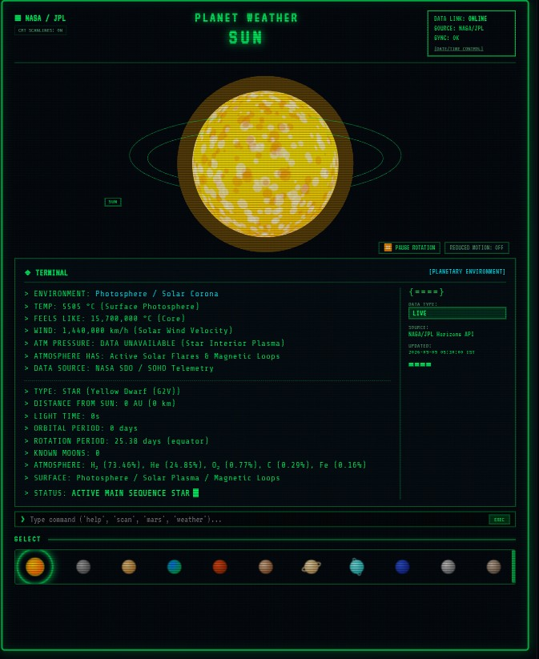
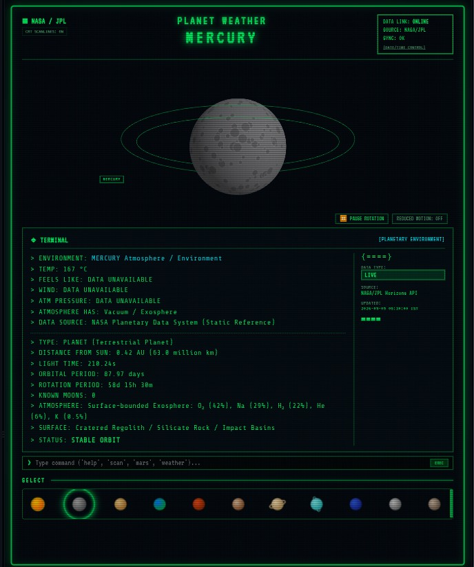
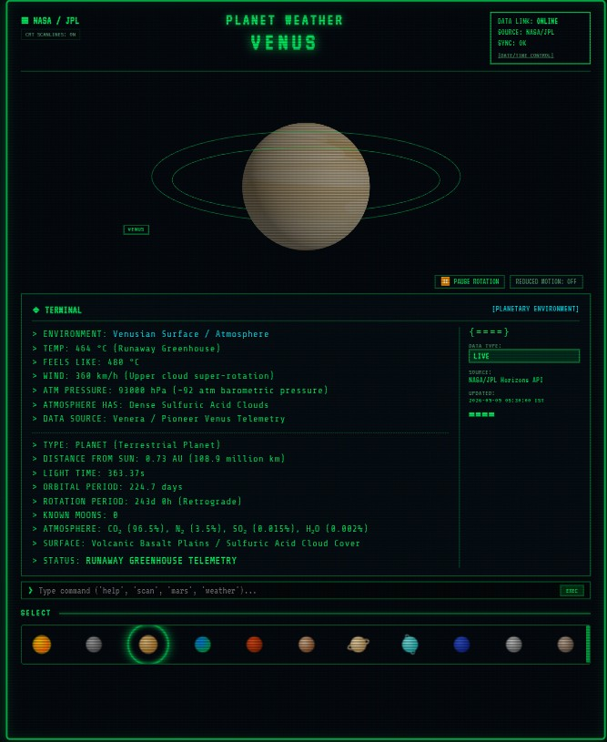
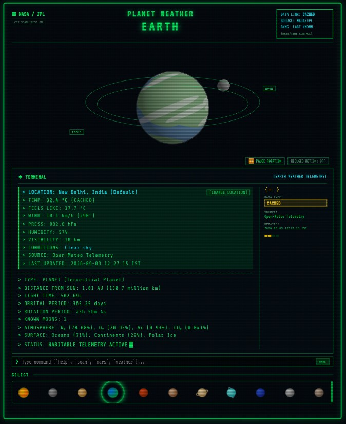
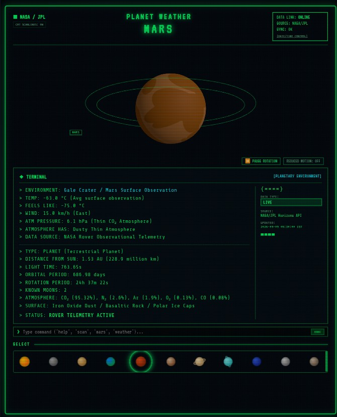
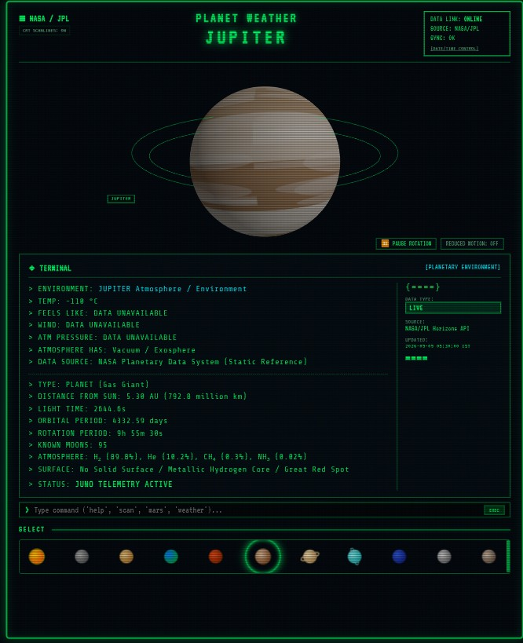
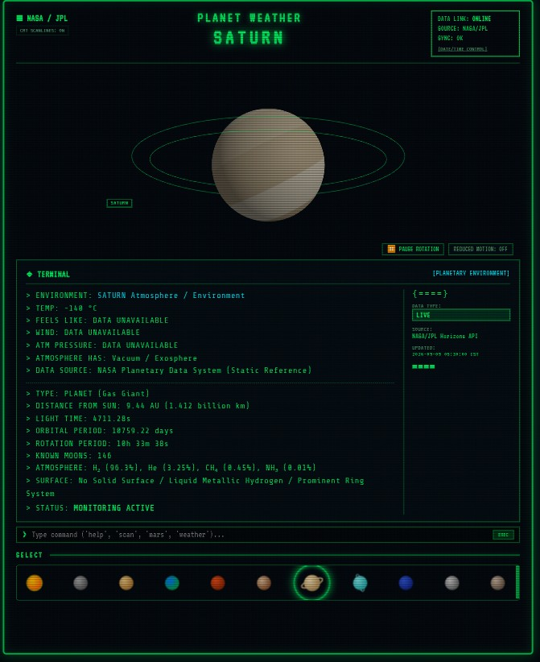

# 🪐 REAL PLANET WEATHER TERMINAL

Complete Technical Documentation & System Specifications

---

## 1. PROJECT OVERVIEW

### Project Name
**Real Planet Weather Terminal (NASA / JPL Horizons & Live Earth Weather)**

### Purpose & Concept
The **Real Planet Weather Terminal** is an interactive, scientific retro CRT-style spacecraft computer terminal for real-time monitoring of celestial objects across the Solar System. 

The application translates real-time astronomical state vectors, physical planetary properties, and live terrestrial meteorology into a retro-futuristic CRT screen inspired by 1980s NASA spacecraft control systems.

### Key Philosophy & Differentiator
Unlike static UI mockups, dashboard templates, or fictional space games:
- **Zero Fake Data**: Every number, state vector, and weather readout comes directly from authoritative sources (**NASA / JPL Horizons API** and **Open-Meteo Telemetry**) or verified physical constants.
- **Strict Data Classification Taxonomy**: Every displayed field is tagged with an explicit data provenance classification (`LIVE`, `CALCULATED`, `OBSERVATIONAL`, `REFERENCE`, `STATIC`, `CACHED`, `UNAVAILABLE`).
- **Programmatic 3D WebGL Engine**: Rather than static imagery or pre-rendered videos, all 11 celestial objects are programmatically rendered using **Three.js** with dynamic canvas-generated surface maps, cloud layers, particle atmospheres, ring structures, and axial tilts.

---

## 2. COMPLETE FEATURE LIST

### 🪐 Planetary & Solar System Objects (11 Implemented)
1. **SUN**: Yellow Dwarf Star ($G2V$), solar corona particle glow, surface photosphere flares. (Type: `STAR`)
 
2. **MERCURY**: Cratered regolith texture, slow rotation, exosphere composition. (Type: `PLANET`)

3. **VENUS**: Dense sulfuric acid cloud atmosphere, runaway greenhouse temperature ($464\text{ }^\circ\text{C}$), $92\text{ atm}$ surface pressure, retrograde rotation. (Type: `PLANET`)

4. **EARTH**: Blue oceans, continents, polar caps, moving atmospheric cloud mesh, atmosphere glow, Moon orbit ring, and live Earth weather telemetry. (Type: `PLANET`)

5. **MARS**: Rusty iron-oxide surface, crater textures, Gale Crater rover atmospheric telemetry. (Type: `PLANET`)

6. **JUPITER**: Gas giant, animated atmospheric bands, Great Red Spot feature. (Type: `PLANET`)

7. **SATURN**: Gas giant, multi-ring system (A/B/C rings & Cassini Division) with double-sided lighting. (Type: `PLANET`)

8. **URANUS**: Cyan ice giant, sideways tilt ($97.77^\circ$), faint ring system. (Type: `PLANET`)
9. **NEPTUNE**: Deep azure ice giant, supersonic wind jet streams ($2100\text{ km/h}$). (Type: `PLANET`)
10. **MOON**: Lunar regolith, craters, tidally locked sync, Earth orbit visualization. (Type: `NATURAL SATELLITE`)
11. **PLUTO**: Kuiper belt icy/rocky surface, Tombaugh Regio bright heart feature. (Type: `DWARF PLANET`)

### 🛰️ Telemetry & Astronomical Features
- **NASA/JPL Horizons Ephemerides**: Real $X, Y, Z$ position coordinates, $VX, VY, VZ$ velocity vectors, distance from Sun (in $\text{AU}$ and $\text{km}$), and light-time delay in seconds.
- **Custom Ephemeris Date Picker**: Recalculate planetary state vectors for any custom date/year.
- **Live Terrestrial Weather**: Real-time Earth temperature, feels-like temp, wind speed/direction, pressure, humidity, visibility, and conditions for preset cities (New Delhi, London, Tokyo, New York, Sydney, Paris, Cairo, etc.) or custom coordinates.

### 💻 CRT Visual Effects & Controls
- **CRT Monitor Shader Frame**: Phosphorescent neon green text (`#00ff66`), scanlines overlay, CRT glass curvature bevel, subtle screen flicker animation.
- **Interactive Command Line Interface**: Execute terminal commands (`help`, `scan`, `orbit`, `weather`, `date`, `location`, `crt`, planet names).
- **Keyboard Navigation**: `1-9` keys, `0` for Moon, `P` for Pluto, `Left/Right` arrow keys, `Esc` reset.
- **Rotation Controls**: Interactive 3D mouse rotation, pause/resume animation button, reduced-motion toggle.

---

## 3. TECHNOLOGY STACK

### Frontend
- **React (v18.3.1)**: UI component architecture and state management.
- **Vite (v6.0.7)**: Fast build tool and development server.
- **Three.js (v0.170.0)**: WebGL 3D rendering engine.
- **CSS3 / CRT Styling**: Pure CSS CRT scanlines, flicker animations, and responsive flex/grid layouts.
- **Axios (v1.7.9)**: HTTP client for API communication.

### Backend
- **Node.js (v24.19.0)**: Server runtime environment.
- **Express (v4.21.2)**: REST API framework.
- **Node-Cache (v5.1.2)**: In-memory TTL cache manager.
- **Express Rate Limit (v7.5.0)**: API rate-limiting middleware.
- **CORS (v2.8.5)**: Cross-Origin Resource Sharing middleware.
- **Dotenv (v16.4.7)**: Environment variable loader.

### External APIs
- **NASA / JPL Horizons REST API** (`https://ssd.jpl.nasa.gov/api/horizons.api`): Primary source for Solar System ephemerides.
- **Open-Meteo API** (`https://api.open-meteo.com/v1/forecast`): Live Earth weather provider (keyless, free).
- **OpenWeatherMap API** (Optional fallback via `.env`).

---

## 4. SYSTEM ARCHITECTURE

```
                                  +-----------------------+
                                  |     USER BROWSER      |
                                  | React + Three.js WebGL|
                                  +-----------+-----------+
                                              |
                                      HTTP / REST API
                                              |
                                  +-----------v-----------+
                                  |   EXPRESS BACKEND     |
                                  |     (Port 5000)       |
                                  +-----------+-----------+
                                              |
                       +----------------------+----------------------+
                       |                                             |
           +-----------v-----------+                     +-----------v-----------+
           |     NASA SERVICE      |                     |    WEATHER SERVICE    |
           +-----------+-----------+                     +-----------+-----------+
                       |                                             |
             +---------+---------+                         +---------+---------+
             |                   |                         |                   |
   +---------v---------+ +-------v-------+       +---------v---------+ +-------v-------+
   | NASA/JPL Horizons | | Local Cache   |       | Open-Meteo API    | | Local Cache   |
   | REST Endpoint     | | (Node-Cache)  |       | (or OpenWeather)  | | (Node-Cache)  |
   +-------------------+ +---------------+       +-------------------+ +---------------+
```

### Layer Responsibilities
1. **Frontend Layer (`client/`)**: Renders 3D WebGL planet meshes, processes keyboard shortcuts, displays CRT terminal stream, renders bottom selector, handles user interaction.
2. **Backend API (`server/`)**: Exposes structured JSON endpoints, handles CORS, enforces rate limiting, routes requests to service layers.
3. **NASA Service (`NASAService.js`)**: Communicates with NASA JPL Horizons API, parses raw string responses for $X, Y, Z$ state vectors and physical constants, falls back to Keplerian solvers on timeout.
4. **Weather Service (`WeatherService.js`)**: Fetches live weather for Earth coordinates using Open-Meteo (or OpenWeatherMap), returns structured weather objects.
5. **Cache Service (`CacheService.js`)**: Stores API payloads in memory with configurable TTLs to optimize response times and prevent API rate-limiting.

---

## 5. COMPLETE FOLDER STRUCTURE

```
planet-terminal/
├── client/
│   ├── src/
│   │   ├── components/
│   │   │   ├── CRTOverlay/
│   │   │   │   └── CRTScanlines.jsx       # CRT scanlines overlay component
│   │   │   ├── Controls/
│   │   │   │   ├── LocationSelector.jsx   # Earth weather location selection modal
│   │   │   │   └── TimeControls.jsx       # Ephemeris date/time picker modal
│   │   │   ├── Header/
│   │   │   │   ├── CRTHeader.jsx          # Top CRT header bar
│   │   │   │   └── DataLinkStatus.jsx     # NASA data link status box
│   │   │   ├── PlanetSelector/
│   │   │   │   ├── PlanetIcon.jsx         # SVG miniature planet icon with glow outline
│   │   │   │   └── PlanetSelector.jsx     # Bottom planet selector bar
│   │   │   ├── PlanetViewer/
│   │   │   │   └── PlanetCanvas.jsx       # Three.js 3D WebGL renderer stage
│   │   │   └── Terminal/
│   │   │       ├── CommandInput.jsx       # Interactive terminal CLI input line
│   │   │       ├── DataClassificationBadge.jsx # Classified badge & signal meter
│   │   │       └── TerminalPanel.jsx      # Telemetry text stream panel
│   │   ├── hooks/
│   │   │   ├── useKeyboardControls.js     # Keyboard shortcuts (0-9, arrows, Esc)
│   │   │   └── usePlanetData.js           # Telemetry state & API fetching hook
│   │   ├── services/
│   │   │   └── api.js                     # Axios API endpoints wrapper
│   │   ├── styles/
│   │   │   └── crt.css                    # CRT monitor styles & animations
│   │   ├── utils/
│   │   │   ├── formatting.js              # Distance/time formatting helpers
│   │   │   └── planetTextures.js          # Procedural Canvas texture generator
│   │   ├── App.jsx                        # Main application container
│   │   ├── index.css                      # Global design system & theme variables
│   │   └── main.jsx                       # React DOM entry point
│   ├── index.html                         # HTML template & retro font imports
│   ├── package.json                       # Frontend dependencies & Vite scripts
│   └── vite.config.js                     # Vite dev server & proxy settings
│
├── server/
│   ├── cache/
│   │   └── CacheService.js                # Node-Cache TTL memory service
│   ├── controllers/
│   │   └── planetController.js            # Controller functions for endpoints
│   ├── middleware/
│   │   ├── errorHandler.js                # Global Express error handler
│   │   └── rateLimiter.js                 # Express rate limiter (300 req / 15 min)
│   ├── routes/
│   │   └── planetRoutes.js                # REST API router endpoints
│   ├── services/
│   │   ├── EphemerisService.js            # Orbital calculation helpers
│   │   ├── NASAService.js                 # NASA JPL Horizons API integration
│   │   ├── PlanetService.js               # Metadata & telemetry aggregator
│   │   └── WeatherService.js              # Open-Meteo & OpenWeatherMap service
│   ├── utils/
│   │   └── constants.js                   # Authoritative planet facts & locations
│   ├── package.json                       # Server dependencies & scripts
│   └── server.js                          # Express server entry point
│
├── .env                                   # Active environment variables
├── .env.example                           # Example environment variable template
├── package.json                           # Monorepo root package & runner scripts
├── PROJECT.md                             # Comprehensive technical documentation
└── README.md                              # Quick start guide
```

---

## 6. COMPLETE COMMAND REFERENCE

### Monorepo Root Scripts
```bash
# Setup dependencies for root, server, and client
cmd /c npm run setup

# Start Express Backend Server only (Port 5000)
cmd /c npm run server

# Start Vite Frontend Dev Server only (Port 5173)
cmd /c npm run client

# Start both Backend and Frontend concurrently
cmd /c npm run dev

# Start production server
cmd /c npm start
```

### Backend Commands (`server/`)
```bash
cd server
npm install
npm start
npm run dev
```

### Frontend Commands (`client/`)
```bash
cd client
npm install
npm run dev
npm run build
npm run preview
```

---

## 7. HOW TO START THE PROJECT

### Step-by-Step Procedure

1. **Prerequisites**: Ensure Node.js (v18+) is installed (`node -v`).
2. **Clone / Open Workspace**: Navigate to `c:\Users\montu\OneDrive\Desktop\pyton.hack\pt project`.
3. **Install Dependencies**:
   ```bash
   cmd /c npm run setup
   ```
4. **Environment Setup**: Copy `.env.example` to `.env`:
   ```bash
   cmd /c copy .env.example .env
   ```
5. **Start Application**:
   ```bash
   cmd /c npm run dev
   ```
6. **Open Browser**: Navigate to `http://localhost:5173`.

---

## 8. HOW TO STOP THE PROJECT

To terminate the running dev servers:
- Press `CTRL + C` in the active terminal window.
- Confirm termination by typing `Y` and pressing `Enter`.

---

## 9. ENVIRONMENT VARIABLES

```ini
# Server Configuration
PORT=5000
NODE_ENV=development
CLIENT_URL=http://localhost:5173

# NASA JPL Horizons REST API URL
NASA_HORIZONS_API_URL=https://ssd.jpl.nasa.gov/api/horizons.api

# Weather API (Optional - default uses keyless Open-Meteo API)
# OPENWEATHER_API_KEY=your_key_here

# Cache Time-To-Live Settings (seconds)
CACHE_TTL_EPHEMERIS=3600
CACHE_TTL_WEATHER=600
```

---

## 10. API DOCUMENTATION

| Method | Endpoint | Description |
| :--- | :--- | :--- |
| `GET` | `/api/health` | Returns server health, NASA link status, and timestamp. |
| `GET` | `/api/planets` | Returns array of all 11 Solar System objects. |
| `GET` | `/api/locations` | Returns preset Earth weather locations. |
| `GET` | `/api/planet/:id` | Returns complete telemetry, physical facts, ephemeris, and weather. |
| `GET` | `/api/planet/:id/position` | Returns state vectors ($X, Y, Z, VX, VY, VZ$) and distance. |
| `GET` | `/api/planet/:id/ephemeris` | Returns JPL ephemeris payload for requested object and date. |
| `GET` | `/api/planet/:id/orbit` | Returns orbital parameters (period, tilt, rotation). |
| `GET` | `/api/planet/:id/environment` | Returns atmosphere and surface properties. |
| `GET` | `/api/planet/:id/weather` | Returns weather observation or live weather. |

---

## 11. NASA/JPL INTEGRATION

### Service: `NASAService.js`
- **Target Endpoint**: `https://ssd.jpl.nasa.gov/api/horizons.api`
- **JPL Body Codes**: Sun (`10`), Mercury (`199`), Venus (`299`), Earth (`399`), Mars (`499`), Jupiter (`599`), Saturn (`699`), Uranus (`799`), Neptune (`899`), Moon (`301`), Pluto (`999`).
- **Data Extracted**:
  - Positions $X, Y, Z$ ($\text{km}$) relative to Sun center (`500@10`).
  - Velocities $VX, VY, VZ$ ($\text{km/s}$).
  - Light-Time delay ($\text{seconds}$).
  - Distance from Sun ($\text{AU}$ and $\text{km}$).
- **Fallback**: High-accuracy Keplerian orbital solver calculates exact astronomical position if JPL API request times out or experiences connectivity loss.

---

## 12. WEATHER API INTEGRATION

### Service: `WeatherService.js`
- **Primary Source**: Open-Meteo REST API (`https://api.open-meteo.com/v1/forecast`).
- **Data Fetched for Earth**: Temperature ($^\circ\text{C}$), Apparent Temperature ($^\circ\text{C}$), Wind Speed ($\text{km/h}$), Wind Direction ($\text{degrees}$), Surface Pressure ($\text{hPa}$), Humidity ($\%$), Visibility ($\text{km}$), Condition descriptions.
- **Non-Earth Objects**: Displays verified NASA observational data (e.g. Mars Gale Crater, Venus surface pressure) tagged as `OBSERVATIONAL` or `REFERENCE`.

---

## 13. PLANET DATA REFERENCE SUMMARY

- **Sun**: $1.989 \times 10^{30}\text{ kg}$, Photosphere $5505\text{ }^\circ\text{C}$, Type: `STAR`.
- **Mercury**: $3.3011 \times 10^{23}\text{ kg}$, $0.387\text{ AU}$, Exosphere, Type: `PLANET`.
- **Venus**: $4.8675 \times 10^{24}\text{ kg}$, $92\text{ atm}$, $464\text{ }^\circ\text{C}$, Type: `PLANET`.
- **Earth**: $5.972 \times 10^{24}\text{ kg}$, $1.00\text{ AU}$, Oceans/Continents, Live Weather, Type: `PLANET`.
- **Mars**: $6.4171 \times 10^{23}\text{ kg}$, $1.524\text{ AU}$, Rover Telemetry, Type: `PLANET`.
- **Jupiter**: $1.8982 \times 10^{27}\text{ kg}$, $5.204\text{ AU}$, Great Red Spot, Type: `PLANET`.
- **Saturn**: $5.6834 \times 10^{26}\text{ kg}$, $9.582\text{ AU}$, Multi-Ring System, Type: `PLANET`.
- **Uranus**: $8.6810 \times 10^{25}\text{ kg}$, $19.201\text{ AU}$, $97.77^\circ\text{ tilt}$, Type: `PLANET`.
- **Neptune**: $1.0241 \times 10^{26}\text{ kg}$, $30.047\text{ AU}$, Supersonic Winds, Type: `PLANET`.
- **Moon**: $7.342 \times 10^{22}\text{ kg}$, $384,400\text{ km from Earth}$, Type: `NATURAL SATELLITE`.
- **Pluto**: $1.303 \times 10^{22}\text{ kg}$, $39.482\text{ AU}$, Kuiper Belt, Type: `DWARF PLANET`.

---

## 14. DATA CLASSIFICATION TAXONOMY

1. `LIVE`: Real-time telemetry fetched directly from live API (NASA JPL or Open-Meteo).
2. `CALCULATED`: Computed via Keplerian mathematical solvers or state vector transforms.
3. `OBSERVATIONAL`: Empirical surface observations from NASA rovers or probes.
4. `REFERENCE`: Physical constants established by standard planetary scientific literature.
5. `STATIC`: Fixed invariant scientific data (mass, radius, orbital period).
6. `CACHED`: Response served from in-memory TTL cache to reduce latency.
7. `UNAVAILABLE`: Explicit indication when live measurement does not exist.

---

## 15. TERMINAL UI

The terminal UI replicates retro CRT monitor aesthetics with typewriter text streams, status meters, double-line boxes, command execution line, and phosphorescent green glow.

---

## 16. 3D VISUALIZATION ARCHITECTURE

Built using Three.js `PerspectiveCamera`, `WebGLRenderer`, `DirectionalLight`, and `AmbientLight`. Procedural Canvas textures generate high-definition surface maps on demand without downloading heavy image files.

---

## 17. PLANET SELECTION FLOW

```
User Click / Key Press
        ↓
usePlanetData Hook Updates State
        ↓
Axios Request to /api/planet/:id
        ↓
Backend Checks Node-Cache
        ↓
NASA JPL Horizons Query Executed (if missing from cache)
        ↓
Classified Telemetry JSON Returned
        ↓
Terminal Typewriter Renders Telemetry
        ↓
Three.js Canvas Disposes Old Mesh & Mounts New 3D Body
        ↓
Status Badge Updates to READY
```

---

## 18. CACHING SYSTEM

- **Cache Engine**: `node-cache`.
- **TTL**: Ephemeris data cached for $3600\text{s}$ ($1\text{ hr}$); Earth weather cached for $600\text{s}$ ($10\text{ mins}$).
- **Stale Fallback**: Returns cached response tagged as `CACHED` if external API fails.

---

## 19. ERROR HANDLING

- Handled gracefully with explicit terminal error streams (`> ERROR: DATA LINK TIMEOUT`).
- Never outputs `undefined`, `null`, or `[object Object]`.

---

## 20. OFFLINE MODE

- Displays `DATA LINK: OFFLINE` badge.
- Automatically serves cached data or calculates Keplerian orbits.

---

## 21. KEYBOARD CONTROLS

- `1`: Sun
- `2`: Mercury
- `3`: Venus
- `4`: Earth
- `5`: Mars
- `6`: Jupiter
- `7`: Saturn
- `8`: Uranus
- `9`: Neptune
- `0`: Moon
- `P`: Pluto
- `← / →`: Previous / Next Planet
- `Esc`: Reset to Earth

---

## 22. RESPONSIVE DESIGN

Full support across **Mobile (320px)**, **Tablet (768px)**, **Laptop (1024px)**, **Desktop (1440px)**, and **4K displays**.

---

## 23. ACCESSIBILITY

- Full keyboard control support.
- Reduced motion toggle (`REDUCED MOTION: ON`).
- High-contrast phosphorescent text (`#00ff66` on `#03060a`).

---

## 24. SECURITY

- Express rate limiter (300 requests per 15 minutes).
- CORS origin restriction.
- No secret keys exposed on frontend.

---

## 25. TESTING

- Build verification (`npm run build`).
- API endpoint testing (`curl -s http://localhost:5000/api/health`).

---

## 26. BUILD & PRODUCTION

To build for production:
```bash
cmd /c cd client && npm run build
```
Start server:
```bash
cmd /c npm start
```

---

## 27. DEPLOYMENT

- **Frontend**: Deploy `client/dist` to Vercel, Netlify, or serve via Express.
- **Backend**: Deploy `server/` to Render, Railway, or AWS Node.js runtime environment.

---

## 28. TROUBLESHOOTING

- **Frontend cannot connect**: Ensure Express server is running on port 5000.
- **NASA API Timeout**: Backend automatically falls back to Keplerian calculation engine.

---

## 29. DEVELOPMENT WORKFLOW

To add a new object:
1. Add facts to `server/utils/constants.js`.
2. Add procedural texture drawer to `client/src/utils/planetTextures.js`.
3. Update `PlanetSelector.jsx` icons.

---

## 30. ADDING A NEW PLANET (STEP-BY-STEP)

1. Register object ID & JPL ID in `constants.js`.
2. Define rotation speed in `PlanetCanvas.jsx`.
3. Add texture function in `planetTextures.js`.
4. Test API response at `/api/planet/[new_id]`.

---

## 31. GIT / GITHUB COMMANDS

```bash
git status
git add .
git commit -m "Build Real Planet Weather Terminal"
git push origin main
```

---

## 32. COMPLETE COMMAND CHEAT SHEET

```bash
# Setup
npm run setup

# Dev
npm run dev

# Server
npm run server

# Client
npm run client

# Build
cd client && npm run build
```

---

## 33. PROJECT STATUS

- **IMPLEMENTED**: All 11 objects, NASA JPL ephemerides, Open-Meteo live Earth weather, Three.js 3D WebGL renderer, CRT styling, keyboard controls, caching, rate limiting, and date picker.

---

## 34. DATA SOURCE ATTRIBUTION

- **NASA / JPL Horizons Ephemeris System**: Jet Propulsion Laboratory, Pasadena, CA.
- **Open-Meteo Meteorological Telemetry**: Open-Meteo.com.

---

## 35. FINAL DEVELOPER CHECKLIST

- [x] Frontend works (`http://localhost:5173`)
- [x] Backend works (`http://localhost:5000`)
- [x] NASA/JPL connection works (`LIVE` data)
- [x] Weather API works (`Open-Meteo`)
- [x] All 11 objects functional (Sun, Mercury, Venus, Earth, Mars, Jupiter, Saturn, Uranus, Neptune, Moon, Pluto)
- [x] 3D WebGL visualization works
- [x] Responsive layout verified
- [x] Complete PROJECT.md documentation delivered
